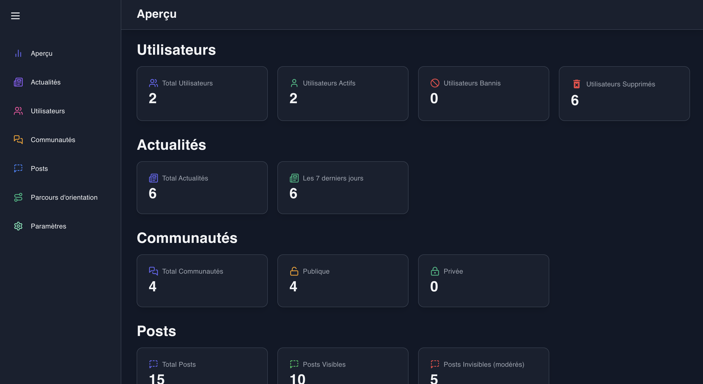

# 📊 Admin Dashboard

### 🎆 Aperçu

🔴 [prod] https://admin-dashboard-etb.vercel.app/



### 🧰 Stack technique

- React
- Tailwind CSS
- Marterial UI
- React Toastify
- Recharts
- Framer Motion

### ⚙️ Lancer localement

⚠️ Ne pas oublier de mettre à jour l'`url` (`VITE_ETB_API_URL`) du backend au niveau des variables d'environnement `.env` si nécessaire. Il est possibible de mettre à jour la variable d'environnement `VITE_ETB_ADMIN_CONTACT_EMAIL` (pour le contact admin si ça doit changer),

- Installer les dépendances

```shell
npm i
```

- Lancer l'app

```shell
npm run start
```
