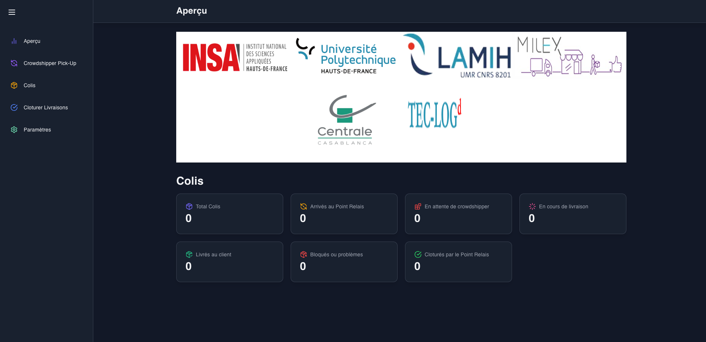

# 📊 Admin Dashboard

### 🎆 Aperçu

🔴 [prod] <https://point-relais-dernier-km.vercel.app/>



### 🧰 Stack technique

- React
- Tailwind CSS
- Marterial UI
- React Toastify
- Recharts
- Framer Motion

### 🗂️ Structure du projet

Le projet est structuré comme suit  :

```bash
my-app/
├── public/               # Fichiers publics (index.html, favicon, images, icônes , styles globaux)
├── src/                  # Code source principal
│   ├── components/       # Composants UI réutilisables
│   ├── pages/            # Chaque écran / page 
│   ├── layouts/          # Layout du side bar global
│   ├── pages/            # Pages principales (si routing basé sur pages)
│   ├── services/         # Appels API, gestion des données externes et state
│   ├── utils/            # Fonctions utilitaires, helpers
│   └── App.tsx           # Composant racine
├── .env                  # Variables d’environnement
├── .gitignore
├── package.json
└── README.md

```

### ⚙️ Lancer localement

⚠️ Ne pas oublier de mettre à jour l'`url` (`VITE_LAST_MILE_API_URL`) du backend au niveau des variables d'environnement `.env` si nécessaire. Il est possibible de mettre à jour la variable d'environnement `VITE_LAST_MILE_ADMIN_CONTACT_EMAIL` (pour le contact admin si ça doit changer),

- Installer les dépendances

```shell
npm i
```

- Lancer l'app

```shell
npm run start
```
